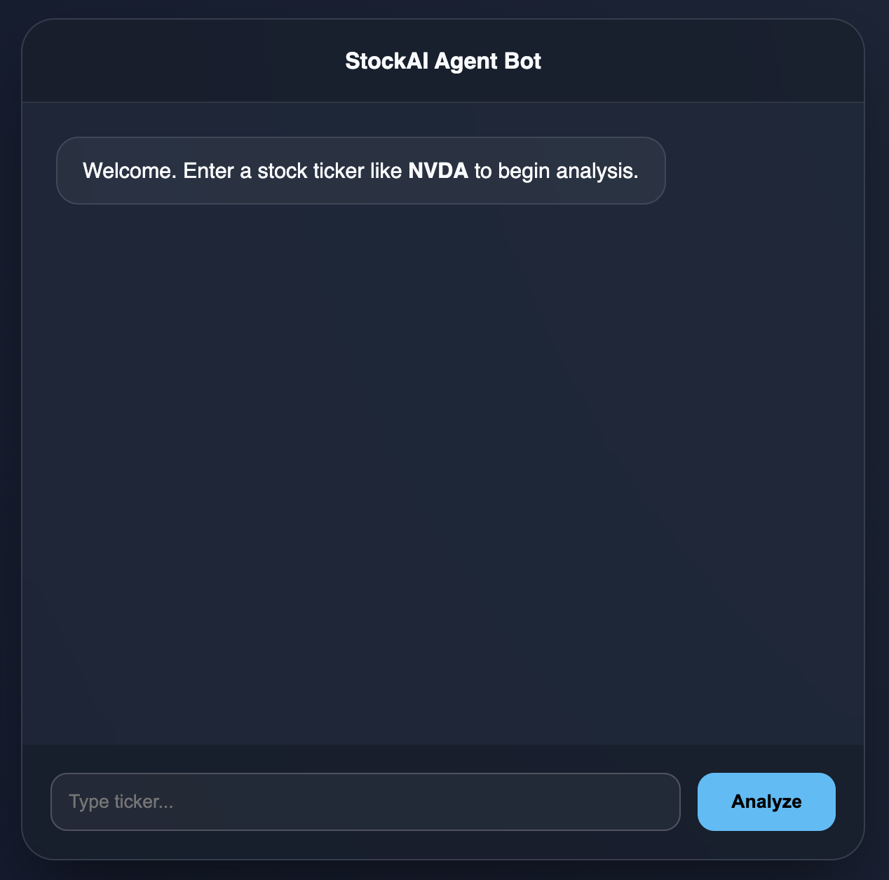
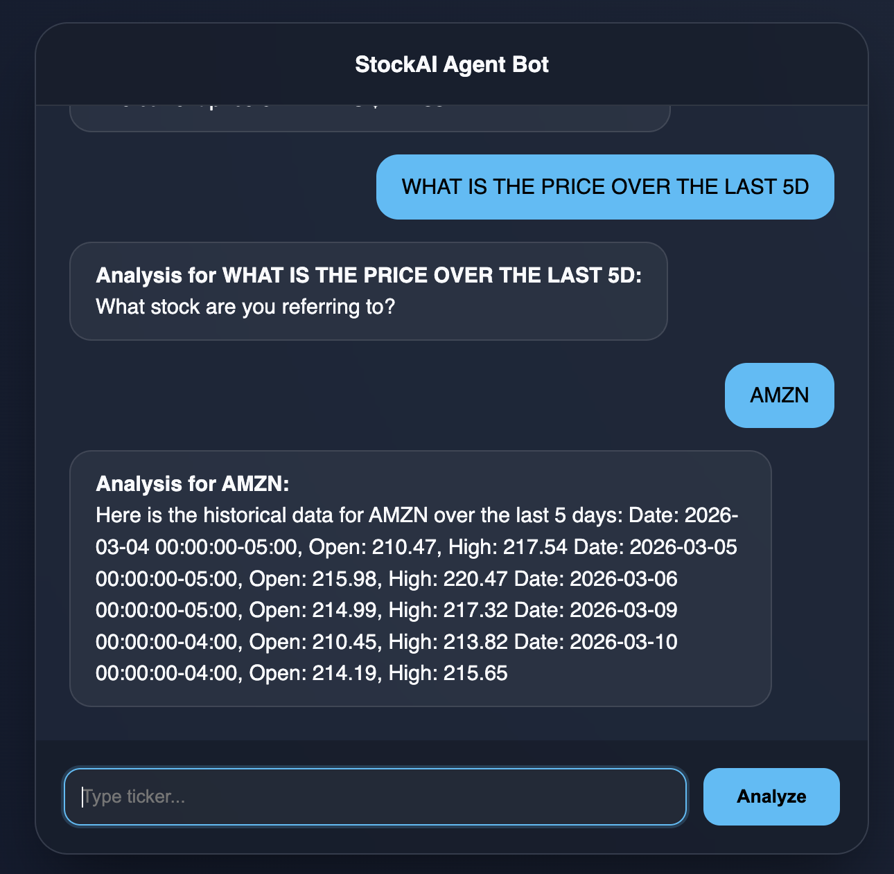
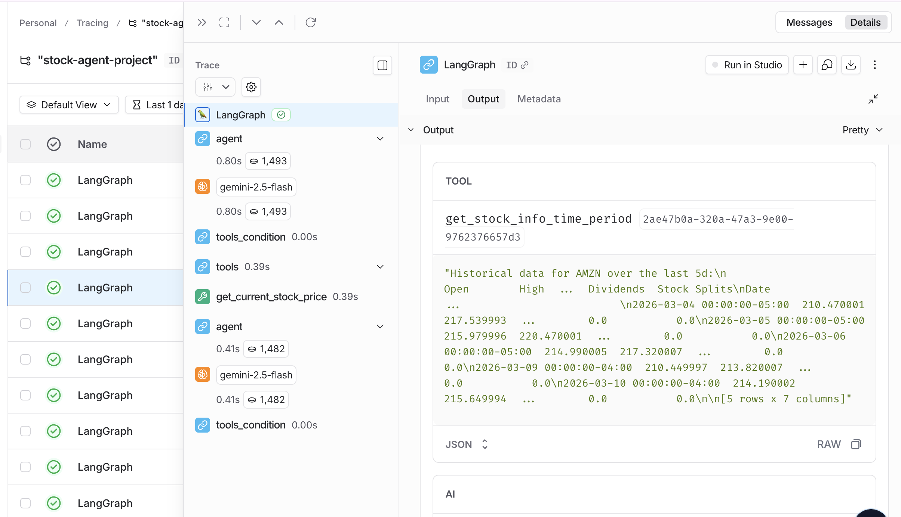

# 📈 AI Stock Research Agent

A production-ready, containerized AI Assistant built with **LangGraph**, **Gemini 2.5 Flash**, and **Yahoo Finance**. This agent uses an autonomous "Reasoning and Acting" (ReAct) workflow to fetch real-time market data and is deployed via a fully automated **Azure DevOps** pipeline.

---

## 📝 Project Overview
The **AI Stock Agent** is a sophisticated financial research tool designed to solve the "knowledge cutoff" problem in LLMs. Instead of relying on static data, it uses custom Python tools to query live stock prices and historical trends.

### Key Features:
*   **Autonomous Reasoning**: Uses a cyclic **StateGraph** to decide when to search for data vs. when to answer the user.
*   **Real-time Tools**: Integrated with `yfinance` to pull live `currentPrice` and historical OHLC data.
*   **Conversational Memory**: Implements `MemorySaver` checkpoints to maintain context across multi-turn dialogues using `thread_id`.
*   **Full Observability**: Integrated with **Langsmith** for real-time tracing of agent "thought processes" and tool execution.

---

## 🧠 Agent Architecture (LangGraph)
The core of the application is a stateful graph that manages the conversation flow:

1.  **Agent Node**: The LLM (Gemini 2.5 Flash) processes the user input and decides if it needs to call a tool.
2.  **Tool Node**: If a tool is called (e.g., `get_current_stock_price`), the graph pauses, executes the Python function, and feeds the result back to the agent.
3.  **Conditional Edges**: Uses `tools_condition` to determine if the loop should continue or if the final answer is ready for the user.

---

## 🚀 DevOps & Deployment Workflow
This project demonstrates a professional-grade **CI/CD pipeline** and cloud-native hosting strategy:

### 1. Continuous Integration (GitHub Actions)
On every push to `main`, a GitHub Action triggers the following:
*   **Docker Build**: Containers are built and tagged with the unique `Git SHA` for perfect version tracking.
*   **Registry Push**: Images are stored in an **Azure Container Registry (ACR)**.

### 2. Continuous Deployment (Azure App Service)
*   **Managed Identity**: The App Service uses a "keyless" **AcrPull** role-based access (RBAC) to securely pull images without stored passwords.
*   **Webhook Trigger**: Azure automatically detects the new image and performs a rolling restart to update the live site.
*   **Environment Injection**: Production secrets (Google API, Langsmith Keys) are managed in the Azure Portal and injected into the container at runtime.

---

## 🛠 Tech Stack
*   **AI Framework**: LangChain & LangGraph
*   **LLM**: Google Gemini 2.5 Flash
*   **Infrastructure**: Docker, Azure Container Registry (ACR)
*   **Cloud Hosting**: Azure App Service (Linux)
*   **CI/CD**: GitHub Actions
*   **Monitoring**: LangSmith Tracing

---

## 📈 Key Learnings & Achievements
*   **Cloud Security**: Implemented **Azure Managed Identities** to eliminate hardcoded credentials in the deployment pipeline.
*   **Agentic Patterns**: Built a robust cyclic graph that handles errors and missing data gracefully.
*   **Production Debugging**: Configured Azure **Log Streams** and **WEBSITES_PORT** settings to optimize container startup performance.

## 🖼️ Project Preview

### Application Interface

### LangSmith Tracing & Observability

